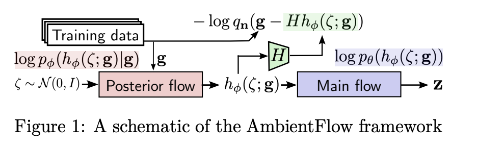
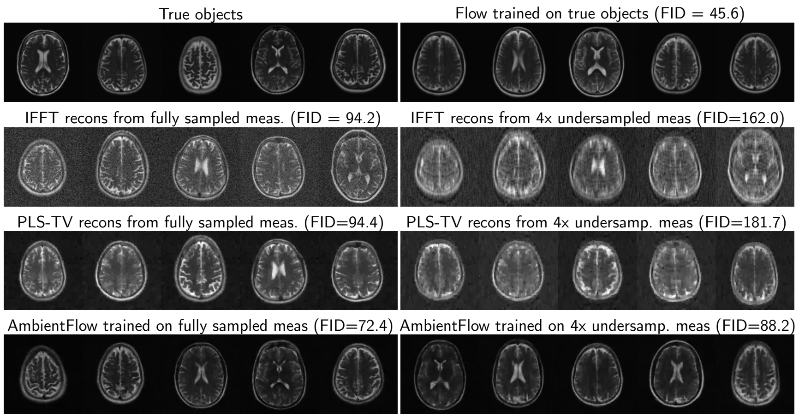

# AmbientFlow: Invertible generative models from incomplete, noisy measurements

PyTorch implementation

**Paper**: https://arxiv.org/abs/2309.04856

Varun A. Kelkar, Rucha Deshpande, Arindam Banerjee, Mark A. Anastasio <br />
University of Illinois at Urbana-Champaign, Urbana, IL - 61801, USA

**Contact**: vak2@illinois.edu, maa@illinois.edu

**Abstract**: Generative models have gained popularity for their potential applications in imaging science, such as image reconstruction, posterior sampling and data sharing. Flow-based generative models are particularly attractive due to their ability to tractably provide exact density estimates along with fast, inexpensive and diverse samples. Training such models, however, requires a large, high quality dataset of objects. In applications such as computed imaging, it is often difficult to acquire such data due to requirements such as long acquisition time or high radiation dose, while acquiring noisy or partially observed measurements of these objects is more feasible. In this work, we propose AmbientFlow, a framework for learning flow-based generative models directly from noisy and incomplete data. Using variational Bayesian methods, a novel framework for establishing flow-based generative models from noisy, incomplete data is proposed. Extensive numerical studies demonstrate the effectiveness of AmbientFlow in learning the object distribution. The utility of AmbientFlow in a downstream inference task of image reconstruction is demonstrated.

<p align="center">


</p>


## System Requirements
- Linux/Unix-based systems recommended. The code hasn't been tested on Windows.
- 64 bit Python 3.8+. The code has been tested with Python 3.8.13 installed via Anaconda

Other packages required are listed in the `requirements.txt` file.

## Directory structure

- The directory `toy` contains the codes corresponding to the toy 2D distribution.

- The directory `scripts/training` contains the top level shell scripts for training the regular and ambient models. Within this directory, `paper_configs.txt` contains the hyperparameter configurations used for the results in the paper. The number of GPUs and batch sizes listed are according to training on a single NVIDIA Quadro RTX 8000 48 GB GPU.

- The directory `src` stores all python code defining the flow networks, forward models (degradation models), data processing pipelines, and utilities. The subdirectory `src/metrics` contains codes for evaluating the trained generative models via FID score, log-odds, empirical mean and covariance estimates, and radiomic features (for the MRI study).

- The directory `masks_mri` contains the undersampling masks relevant to the Fourier undersampling forward operators used for the stylized MRI study.

- The directory `recon` contains the python codes for running image reconstruction/restoration algorithms including baseline classical algorithms, compressed sensing using generative models (CSGM), and posterior sampling via annealed Langevin dynamics. The details of these approaches can be found in our paper. 

## Data

The data for the toy study is generated according to `toy/data.py`. The data for the MNIST, CelebA and MRI studies are obtained from the following resources:
- MNIST : Torchvision dataset: https://pytorch.org/vision/stable/generated/torchvision.datasets.MNIST.html
- CelebA-HQ : https://github.com/tkarras/progressive_growing_of_gans
- MRI: T2-weighted brain image volumes from the FastMRI Initiative Database: https://fastmri.med.nyu.edu/

## Model weights

The weights of our trained models can be found at (coming soon).

## Citations
```
@article{kelkar2023ambientflow,
  title={AmbientFlow: Invertible generative models from incomplete, noisy measurements},
  author={Kelkar, Varun A and Deshpande, Rucha and Banerjee, Arindam and Anastasio, Mark A},
  journal={arXiv preprint arXiv:2309.04856},
  year={2023}
}
```
